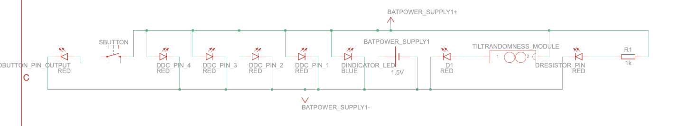

# ProtoBoard

An open-source I/O control board designed for easy assembly from common parts. It features random signal generation, an LED status indicator, and power control.

## Features
- **Random Signal Generation**: A pin outputs a random on/off signal.
- **LED Status Indicator**: Onboard LED provides visual feedback for power status.
- **Power Control**: Includes a button-controlled output pin and a resistor-based lower voltage output pin.
- **Compact Design**: Ideal for simple projects.

## Total Pins
The ProtoBoard includes a total of **9 pins**:
1. **+ Battery Pin**: Connect the positive terminal of your power source.
2. **- Battery Pin**: Connect the negative terminal of your power source.
3. **Randomness Pin**: Outputs a random on/off signal generated by the randomness module.
4. **Ground (GND) Pin**: Provides a ground connection.
5. **Button Output Pin**: Provides power only when the onboard button is pressed.
6. **Resistor Pin**: Outputs a lower voltage, ideal for components requiring reduced power.
7. **DC Pins (x4)**: Directly output power from the battery.

## Assembly
The ProtoBoard is designed to be easy to assemble using basic components:
1. **Prepare Components**: Gather basic parts such as wires, resistors, LEDs, a button and a 3d printed (if possible) enclosure.
2. **Assemble the Board**:
   - Solder the power input pins (**+ Battery** and **- Battery**) to your board.
   - Connect an LED directly to the power source for the status indicator.
   - Install the randomness module and connect it to the **Randomness Pin**.
   - Add a button and connect it to the **Button Output Pin**.
   - Include a resistor inline with the **Resistor Pin** for voltage regulation.
   - Attach connections for the **DC Pins** to output direct power.
3. **Test the Board**: Once assembled, connect a power source and test each pin to ensure proper functionality.

## Randomness Module Assembly Guide

The randomness module generates random on/off signals. Here's how to build it:

### Materials Needed
- Two short wires
- Soldering iron
- Electrical tape or heat shrink tubing
- Aluminum foil

### Steps
1. **Prepare the Wires**:
   - Cut and strip two short pieces of wire.

2. **Create the Randomness Mechanism**:
   - Crumple a small piece of aluminum foil into a loose ball.
   - Solder one wire to each side of the foil.

3. **Install in the Board**:
   - Place the foil inside the board where it can move slightly.
   - Connect one wire to the **+ Battery Pin** and the other to the **Randomness Pin** on the ProtoBoard.

4. **Test the Module**:
   - Power the board and observe random pulses at the **Randomness Pin** as the foil shifts due to vibrations.

### How It Works
The foil moves with small vibrations, intermittently completing the circuit and generating random on/off signals for the **Randomness Pin**.

# Circuit Example

The protoboard and it's circuit can be assembled and modified in multiple different ways.

